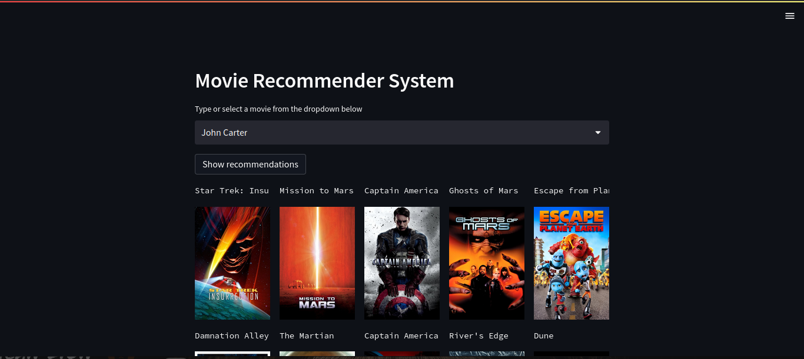
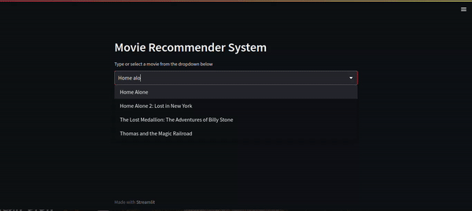

# Movie Recommender

> In this project I used the movie data and created a movie recommendation user interface.

The movie data contains more than 4800 movies and when a user passes title of any movie
the website will come up with 10 related movies to recommend to the user.

 

## Built With

- Python
- Streamlit

## Live Demo

[Live Demo Link for the movie recommender](https://micky373-movie-recommender-movie-recommender-30zzn3.streamlit.app/)

## Getting Started Locally

> git clone `https://github.com/Micky373/movie_recommender.git`

> cd movie_recommender

> pip install -r requirements.txt

> streamlit run movie_recommender.py

> Then go and on any browser put this link (http://localhost:8501/)

> Then put a movie in the box or select from those in the list.

> Then the website will show you the top 10 recommendations.

> More clear discription about how the recommendation system was built and the API fetching can be found in the `notebooks` folder.

## Author

- GitHub: [@GitHub](https://github.com/Micky373)

- LinkedIn: [LinkedIn](https://www.linkedin.com/in/michaeltamirie/)

## 🤝 Contributing

Contributions, issues, and feature requests are welcome!

Feel free to check the [issues page](https://github.com/Micky373/movie_recommender/issues).

## Show your support

Give a ⭐️ if you like this project!

## Acknowledgments

- Special thanks to [CampusX youtube channel](https://www.youtube.com/@campusx-official)
